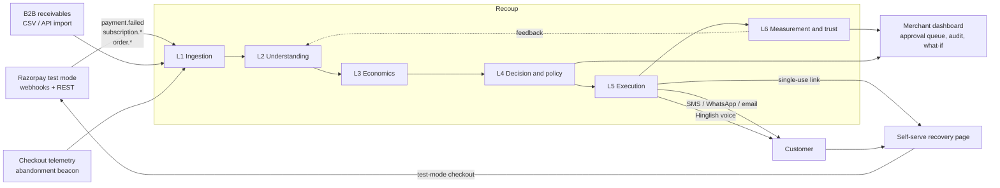

# Recoup

[](https://github.com/RITHAN-SIVASAMY/recoup/actions/workflows/ci.yml)

**A risk-aware, causally-measured revenue recovery agent for Razorpay merchants.**
Razorpay AI Buildathon · Track 03 — AI Revenue Recovery

```bash
git clone --recurse-submodules https://github.com/RITHAN-SIVASAMY/recoup.git
cd recoup && make setup && make demo
```

> `--recurse-submodules` matters: the specification lives in `docs/`, a pinned submodule.
> Already cloned? `git submodule update --init --recursive`

---

## What it does

Recoup watches the four places a merchant's revenue quietly leaks — failed payments, abandoned checkouts, failed UPI Autopay / e-mandate renewals, and overdue B2B receivables — diagnoses *why* the money didn't arrive, decides whether chasing is worth it at all, runs a bounded and compliant recovery workflow across SMS, WhatsApp, email, a self-serve recovery page and a Hinglish voice call, and then proves how much of the recovered money it actually *caused*.



Full decomposition, sequence diagrams and the trade-offs made on purpose: [`docs/03-ARCHITECTURE.md`](docs/03-ARCHITECTURE.md).

**The headline block** (generated by `make demo`, never typed by hand — and never
quietly re-rolled until it looked better):

```
RECOUP · BATCH b_seed42_2000 · seed 42 · 2000 cases
At risk                        ₹ 17,36,12,265
Raw recovered (treated)        ₹ 4,92,11,755    ← overstates our impact
Incremental recovered          ₹ -51,79,409     (95% CI ₹ -1,29,40,473 – ₹ 25,81,655)
Lift                           -4.3 pp          z = -1.31, p = 0.1909   *** NOT SIGNIFICANT ***
Cost per ₹ recovered           undefined (no incremental recovery)
Actions blocked by policy      388              Audit chain: VERIFIED · replay equality PASS
```

This is the actual, current output of `make demo` on the canonical seed — and it
is a **null result**. Raw recovered looks like ₹4.9 crore of impact; against a real
randomized control group, this batch cannot prove any of it was caused by Recoup
rather than would have happened anyway. Most recovery tools would still show you
the ₹4.9 crore number. Recoup shows you this instead, because that's the entire
point of holding out a control group: **a tool that always finds a win isn't
measuring anything.** Reproduce it yourself: `git clone` → `make setup` →
`make demo`. A second run reproduces the same case pool and cohort split exactly;
the exact ₹ figure can drift a percent or two run to run for a documented reason —
see [`TESTING_GUIDE.md`](TESTING_GUIDE.md).

## Why it is different

| | Typical recovery bot | Recoup |
|---|---|---|
| Objective | maximize successful retries | maximize **incremental** value net of cost |
| Measurement | raw recovered ₹ | lift vs. a stratified control, with CI, z-test and MDE — and an **adaptive holdout** that shrinks as evidence accumulates |
| Targeting | chase everything | uplift segmentation — sure things, lost causes and sleeping dogs are deliberately left alone |
| Cost | unaware | per-action cost model + EV gate; refuses to spend ₹4 chasing ₹60 at 8% uplift |
| Limits | `if attempts > 3: stop` | policy-as-code with Hypothesis invariant tests, quiet hours, consent, mandate cadence, rolling contact budget |
| Authority | agent does everything | LLM drafts and explains; **deterministic code decides and executes**; approval gate, staged undo window, kill switch |
| Explainability | LLM chat that improvises | grounded Q&A over a hash-chained event log, with citations and enforced refusal |
| Failure | happy path | chaos suite with a live "Break it" control; DLQ, circuit breakers, degraded mode, zero lost cases |

## The one architectural sentence

> **The LLM proposes. Deterministic code disposes. The log remembers everything.**

The authority boundary is written down as a table in [`docs/01-FRD.md` §11](docs/01-FRD.md) and enforced by an architecture test: no LLM call may decide whether an action is permitted, or execute one.

## What we deliberately did not build

- **No open-ended agent chat.** The dashboard has one narrowly-scoped grounded
  Q&A box, not a chatbot — because a chatbot is exactly the surface where an
  LLM could improvise a decision or a fabricated fact.
- **No auto-approval above the merchant's threshold**, ever — a human signs
  off, and even then the action sits in a cancellable window before it sends.
- **No permanent control group.** A holdout that never shrinks is a permanent
  tax on the merchant; the schedule decays toward a floor once the effect is
  established, logged either way.
- **No production regulatory certification claimed.** Quiet hours, consent,
  and mandate-cadence rules are conservative, named, test-covered defaults —
  *alignment by design, verification required* — not a compliance sign-off.
- **No live third-party dependency in the demo path.** Everything runs against
  Razorpay test-mode APIs and a seeded synthetic generator, so the story you
  see is reproducible on a plane with no network.
- **No multi-tenant merchant model yet.** One policy config, one merchant
  profile — real per-merchant policy tuning is future work, not pretended.

## Try it yourself

Beyond `make demo`, [`TESTING_GUIDE.md`](TESTING_GUIDE.md) is a hands-on walkthrough of every
dashboard feature — the approval queue and undo window, the kill switch, the
live chaos "Break it" control, the grounded Q&A refusal test, the what-if
simulator — with exact things to click and what you should see.

## Documentation

| Document | What it answers |
|---|---|
| [FRD](docs/01-FRD.md) | What it must do, refuse to do, and prove |
| [Problem & differentiation](docs/02-PROBLEM-AND-DIFFERENTIATION.md) | Why anyone needs it |
| [Architecture](docs/03-ARCHITECTURE.md) | How it fits together, and the trade-offs made on purpose |
| [Execution plan](docs/04-EXECUTION-PLAN.md) | The 8-day build plan and the full tech stack |
| [Evaluation protocol](docs/05-EVALUATION-PROTOCOL.md) | How every number is produced — pre-registered |
| [Compliance matrix](docs/06-COMPLIANCE-MATRIX.md) | Every rule → config → code → test |
| [Incident log](docs/09-INCIDENT-LOG.md) | What broke while building it, and how it was fixed |

## Stack

Python 3.12 · FastAPI · Pydantic v2 · SQLAlchemy 2 · Postgres 16 · Redis · arq · LightGBM · SHAP · statsmodels · Claude (Anthropic API) · edge-tts + faster-whisper · Next.js 16 · Tailwind + shadcn/ui · Docker Compose · GitHub Actions · Hypothesis

Deliberately **not** used: an agent framework, a vector database, Kafka, microservices, Streamlit — each with a reason in [`docs/03-ARCHITECTURE.md` §12](docs/03-ARCHITECTURE.md).

## Commands

```bash
make setup     # deps, database, migrations, pre-commit
make data      # regenerate the seeded synthetic batch (SEED=42)
make train     # train models, write metrics + model cards
make run       # api + worker + web
make demo      # end-to-end batch (seed 42, 2000 cases); prints the headline block
make verify    # hash-chain verification + replay equality
make chaos     # failure-injection suite
```

## Honest limitations

Runs on Razorpay **test-mode** APIs and synthetic data. The reported numbers describe our stated data-generating process, not production performance — the *method* is what transfers. Regulatory constants are conservative, named, test-covered defaults requiring verification against current NPCI / RBI / TRAI instruments before any production use: **alignment by design, not certification**. Full threats-to-validity in [the evaluation protocol](docs/05-EVALUATION-PROTOCOL.md) §8.

## License

MIT
